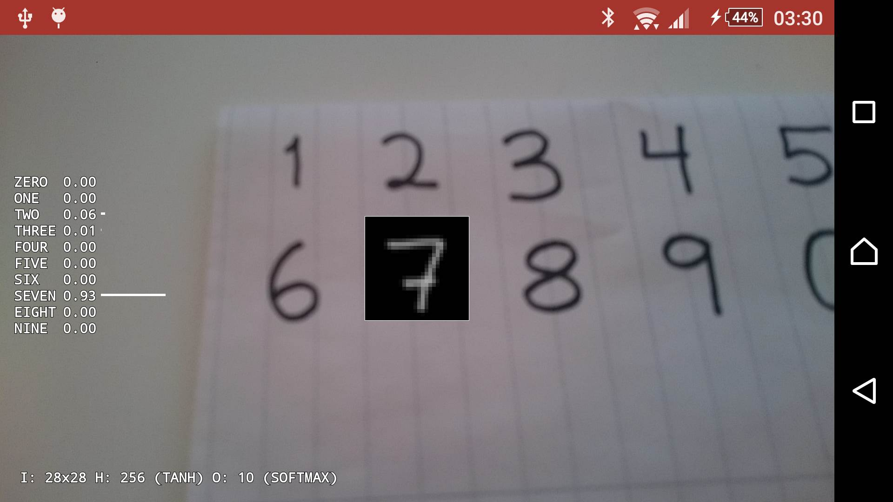

# MLVIS

MLVIS is an Android app which lets you test arbitrary Multilayer Perceptron Artificial Neural Networks with camera input. Network dimensions and weights are describes in a JSON file (optionally gzipped) which is parsed and evaluated by the app. Currently the app supports the activation functions `sigmoid`, `tanh`, `relu` and `softmax`.

* https://en.wikipedia.org/wiki/Multilayer_perceptron



# Demo

Download the app and test it on a network trained on the MNIST (handwritten digits) dataset.

* [App Download](http://www.veierland.net/files/mlvis-1.apk)

* [Example Network JSON (4.3 MB)](http://www.veierland.net/files/mnist.json)

* [Example Network JSON - Gzipped (1.8 MB)](http://www.veierland.net/files/mnist.json.gz)

# Network description

The following shows how JSON describing a Theano tutorial network can be generated:

```python
import json, gzip
with gzip.GzipFile('mlvis.json.gz', 'wb') as json_output_file:
    json_output_file.write(json.dumps([
        {
            "type": "multilayer_perceptron"
        },
        [
            {
                "input_dimensions": [28, 28],
                "layer_sizes": [
                    classifier.hiddenLayer.b.get_value().shape[0],          # Layer 1 size
                    classifier.logRegressionLayer.b.get_value().shape[0] ]  # Layer 2 size
            },
            [
                # Layer 1:
                {
                    "activation_function": "tanh",
                    "bias": classifier.hiddenLayer.b.get_value().tolist(),
                    "weights": numpy.transpose(classifier.hiddenLayer.W.get_value()).tolist()
                },
                # Layer 2:
                {
                    "activation_function": "softmax",
                    "labels": [ "ZERO", "ONE", "TWO", "THREE", "FOUR", "FIVE", "SIX", "SEVEN", "EIGHT", "NINE" ],
                    "bias": classifier.logRegressionLayer.b.get_value().tolist(),
                    "weights": numpy.transpose(classifier.logRegressionLayer.W.get_value()).tolist()
                }
            ]
        ]]).encode('utf8'))
```

See: http://deeplearning.net/tutorial/mlp.html

# Hacking

The input image is a multiple of the network input dimensions as given by the following constant:

* https://github.com/pveierland/mlvis/blob/master/MLVIS/app/src/main/java/net/veierland/mlvis/mlp/MultilayerPerceptronVisualizer.java#L42

A very basic filter is used to enchance image features. Tweaking this may be necessary on different hardware. Hopefully a filter based on Otsu's method or similarly will be implemented soon.

* https://github.com/pveierland/mlvis/blob/master/MLVIS/app/src/main/java/net/veierland/mlvis/mlp/MultilayerPerceptronVisualizer.java#L197

* https://en.wikipedia.org/wiki/Otsu's_method

# Contribute

This is a toy. Clear bugs will be fixed when reported. Feature requests are accepted in the form of complete patches.

# License

* http://www.wtfpl.net
